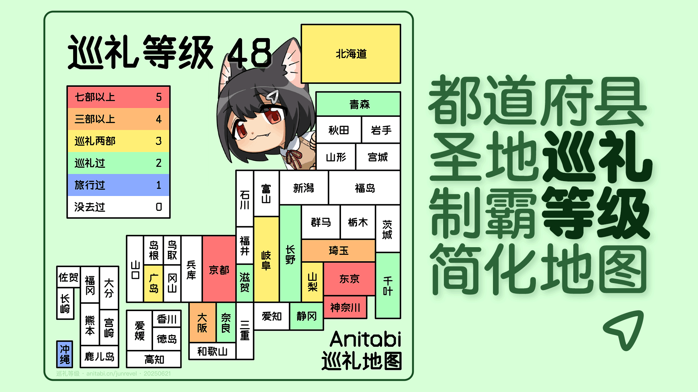

# 📌「巡礼等级」标记你的都道府县圣地巡礼制霸等级

在线地址：https://anitabi.cn/junrei-level/

做了一个标记都道府县圣地巡礼制霸等级的在线工具

## 功能
 - 可以在线标记都道府县巡礼作品数
 - 标记后可生成图片进行社区分享
 - 信息记录在本地存储，有新进展打开网页即可更新
 - 绘制了极端简化的都道府县地图
 - 自行实现了所需字形的中线字体
 - 有可爱看板娘朝日礼猫猫动画和语音 :3

## 待实现功能
 - 看板娘口型同步
 - 待机动作
 - 根据巡礼地图中的打卡信息展示记录
 - 定期生成「都道府县巡礼等级周期报告」
 
## 说明
和中国制霸一样，对日本都道府县在保留地缘相接特征的基础上进行了极端简化，实现一目了然的展现地缘关系

仅包含 1都、1道、2府、43县 共47个行政区

 - 朝日礼猫猫形绘制 @Akebi通草
 - 中线字体设计实现 @itorr
 - 简化地图设计实现 @itorr

## 社交媒体
 - 微博 [@动画巡礼](https://weibo.com/u/5887774003) 
 - Bilibili [@动画巡礼](https://space.bilibili.com/3546874137021353)
 - 小红书 [@Anitabi动画巡礼](https://www.xiaohongshu.com/user/profile/674beccc000000001d02d24c)

## 参考
 - 国土数値情報 https://nlftp.mlit.go.jp/ksj/
 - 中国制霸 https://lab.magiconch.com/china-ex/
 - 制縣等級 https://zhung.com.tw/japanex/

## GitHub
https://github.com/anitabi/junrei-level

